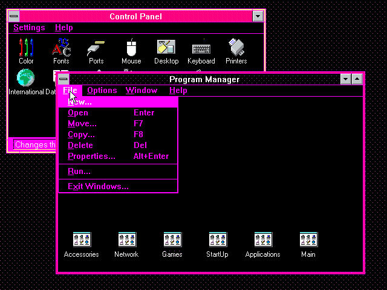

# Windows 3.11

This will give two possible palettes. One for the modern monitor and one for a CRT/CRT-emulated one.
Of course you can try the CRT one on a modern monitor without CRT/CRT-emulation but it will most likely look weird.
For both of these palettes goes the same. It looked good on my machine. It might look totally different on your machine.

# Modern monitor



This palette in the dir `modern`, will hold the palette for a modern monitor. It cannot handle [dithering](https://en.wikipedia.org/wiki/Dither#Digital_photography_and_image_processing) quite right.
This is because in CRT monitors from yore, the scanlines would provide the color blending. So this is basically based on solid colors only, unless a dithering is not that distracting.

## Installation

You can either copy the file, edit the contents of `CONTROL.INI` or use the `Colors` app to edit the colours that way inside Windows.

### Copy file

In a fresh install of Windows 3.11 installed to `C:\WINDOWS`, place `CONTROL.INI` in place of existing file in `C:\WINDOWS\`.

### Edit file

Otherwise either put the following content in there:

```
[current]
color schemes=StealthyCoder

[color schemes]
... Other color schemes
StealthyCoder=D0005,FFFFFF,FFFFFF,0,FFFFFF,0,800000,FFFFFF,FFFF,C0C0C0,C0C0C0,0,C0C0C0,C0C0C0,808080,0,C0C0C0,800000,FFFFFF,0,FFFFFF

[Custom Colors]
ColorA=D0005
```

### Create in Windows

Or just create Custom Colors with the following RGB values:

1. `R:5 G:0 B:13`

# CRT / CRT-emulated monitor


This palette in the dir `crt`, will hold the palette for a CRT/CRT-emulated monitor. For the emulation part what was used was a [86Box](https://86box.readthedocs.io/en/latest/) with the following configuration:

```
[Machine]
machine = 486sp3
cpu_family = i486dx
cpu_speed = 50000000
cpu_multi = 1
fpu_type = internal
cpu_use_dynarec = 0
fpu_softfloat = 0
time_sync = local
mem_size = 32768

[Video]
gfxcard = vga

[Input devices]
mouse_type = logibus

[Sound]
sndcard = sb16
fm_driver = nuked

[Network]
net_01_card = 3c503
net_01_net_type = slirp
net_01_link = 0
net_02_link = 0
net_03_link = 0
net_04_link = 0

[Storage controllers]
hdc = ide_pci
cassette_mode = load

[Hard disks]
hdd_01_parameters = 31, 16, 967, 0, ide
hdd_01_fn = MSDOS.vhd
hdd_01_speed = ramdisk
hdd_01_vhd_blocksize = 4096
hdd_01_ide_channel = 0:0

[Floppy and CD-ROM drives]
fdd_01_type = 35_2hd
fdd_02_type = none
cdrom_01_speed = 24
cdrom_01_parameters = 1, atapi
cdrom_01_ide_channel = 0:1
cdrom_01_type = 86BOX_CD-ROM_1.00

[3Com EtherLink II #1]
mac = 5f:ee:1c
```

Then set the [Renderer mode](https://86box.readthedocs.io/en/latest/usage/menubar.html#view) to OpenGL. Then in the View menu there will be a `Renderer options` section.
Then load in a `.glsl` shader from [libretro](https://github.com/libretro/glsl-shaders/tree/master/crt/shaders) project. In this case the one used was: `crt/shaders/crt-consumer/linearize.glsl`.

It worked really well, it kept the bright areas bright and solid and blended the dithered colors as good as it can be emulated.

> It can be a bit darker than normal, so increasing the brightness of your monitor might be needed.

## Installation

You can either copy the file, edit the contents of `CONTROL.INI` or use the `Colors` app to edit the colours that way inside Windows.

### Copy file

In a fresh install of Windows 3.11 installed to `C:\WINDOWS`, place `CONTROL.INI` in place of existing file in `C:\WINDOWS\`.

### Edit file

Otherwise either put the following content in there:

```
[current]
color schemes=StealthyCoder

[color schemes]
... Other color schemes
StealthyCoder=D0005,FFFFFF,FFFFFF,0,FFFFFF,0,800000,FFFFFF,FFFF,C0C0C0,C0C0C0,0,C0C0C0,C0C0C0,808080,0,C0C0C0,800000,FFFFFF,0,FFFFFF

[Custom Colors]
ColorA=D0005
```

### Create in Windows

Or just create Custom Colors with the following RGB values:

1. `R:5 G:0 B:13`
